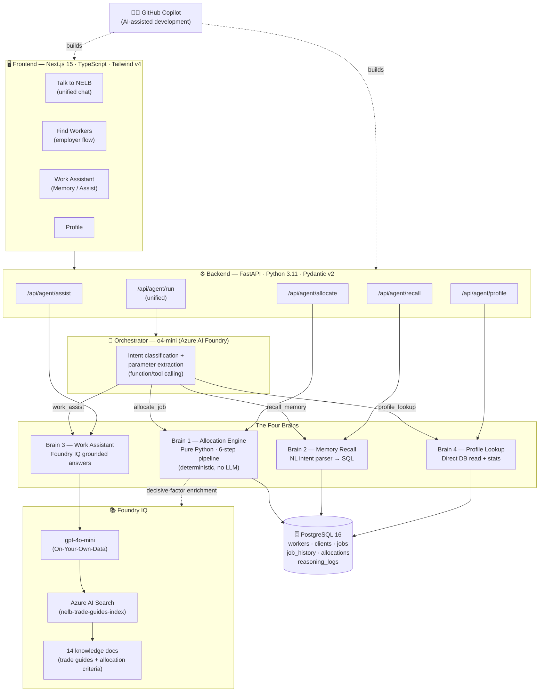
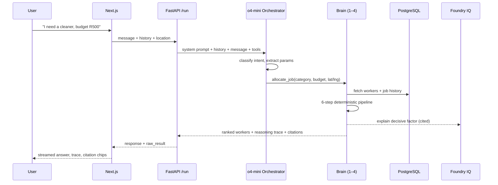

# NELB — System Architecture

This document reflects the **current, implemented** architecture (not aspirational). Use it as the basis for the submission architecture diagram.

---

## High-level flow

---

## Request lifecycle (Talk to NELB)

---

## Component breakdown

### Frontend — Next.js 15 (App Router)
| Piece | Role |
|-------|------|
| `app/agent` | Talk to NELB — unified natural-language chat, routes to any brain |
| `app/employer` | Find Workers — structured job form + live Leaflet map → ranked results |
| `app/worker` | Work Assistant — Memory (job history) / Assist (grounded Q&A) modes |
| `app/profile` | Worker profile + computed stats |
| Zustand stores | `agentChat`, worker store, job store — in-memory chat persistence across navigation |
| React Leaflet | Map pin + radius circle (CartoDB tiles, dark/light aware) |

### Backend — FastAPI (Python 3.11)
| Endpoint | Brain |
|----------|-------|
| `POST /api/agent/run` | Unified — o4-mini selects the tool |
| `POST /api/agent/allocate` | Brain 1 directly |
| `POST /api/agent/recall` | Brain 2 directly |
| `POST /api/agent/assist` | Brain 3 directly |
| `POST /api/agent/profile` | Brain 4 directly |

### Orchestrator — o4-mini (Azure AI Foundry)
- Receives the user message + recent conversation history + available tool definitions.
- Performs **intent classification and parameter extraction** via function/tool calling.
- Routes to exactly one of the four brains, or answers directly if out of scope.

### The Four Brains
1. **Allocation Engine** (`services/allocation/engine.py`) — pure deterministic Python. 6-step pipeline: self-exclusion → skills → reliability → availability → distance (Haversine) → budget fit → fairness. Composite scoring (Skill 25 / Reliability 20 / Distance 20 / Fairness 20 / Budget 15). Emits a full reasoning trace + margin-based confidence.
2. **Memory Recall** (`services/memory/recall.py`) — natural-language intent parser → SQLAlchemy query over `job_history`. No LLM in retrieval.
3. **Work Assistant** (`services/assistant/assist.py`) — **Foundry IQ**: Azure OpenAI `gpt-4o-mini` with an `azure_search` data source (On-Your-Own-Data). Returns cited, grounded answers; refuses out-of-scope/unsafe topics.
4. **Profile Lookup** (`services/profile/lookup.py`) — direct DB read + computed stats (total jobs, recent jobs, avg rating).

### Foundry IQ (the required Microsoft IQ layer)
- **Azure AI Search** index `nelb-trade-guides-index` holds 14 indexed knowledge documents.
- Brain 3 calls `gpt-4o-mini` with the search index as a data source → cited, grounded answers.
- Brain 1 also queries Foundry IQ to **explain the decisive factor** between the top two candidates (allocation enrichment), with a cited source.

### Data — PostgreSQL 16
`workers` · `clients` · `jobs` · `job_history` · `allocations` · `reasoning_logs`. Accessed via SQLAlchemy async (asyncpg). Local dev via Docker Compose.

### Development — GitHub Copilot
AI-assisted development across backend and frontend (contest tool requirement).

---

## What is and isn't in the system (honesty note)

**Implemented:**
- Azure AI Foundry (o4-mini orchestrator + gpt-4o-mini for Foundry IQ)
- Foundry IQ via Azure AI Search "On Your Own Data" with citations
- Deterministic 6-step allocation engine with 24 unit tests
- Demo authentication (3 seeded worker accounts, client-side) — no production auth layer
- Haversine distance (no external maps API)

**Not implemented (deliberately out of scope for the hackathon build):**
- Supabase / JWT production auth
- Azure Maps travel-time (Haversine only)
- Azure App Service / Vercel production deployment (runs locally + can be deployed)

This list exists so the diagram and description never claim something the code doesn't do.
