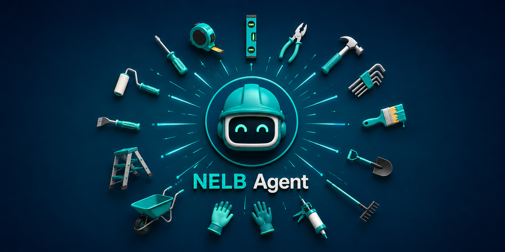
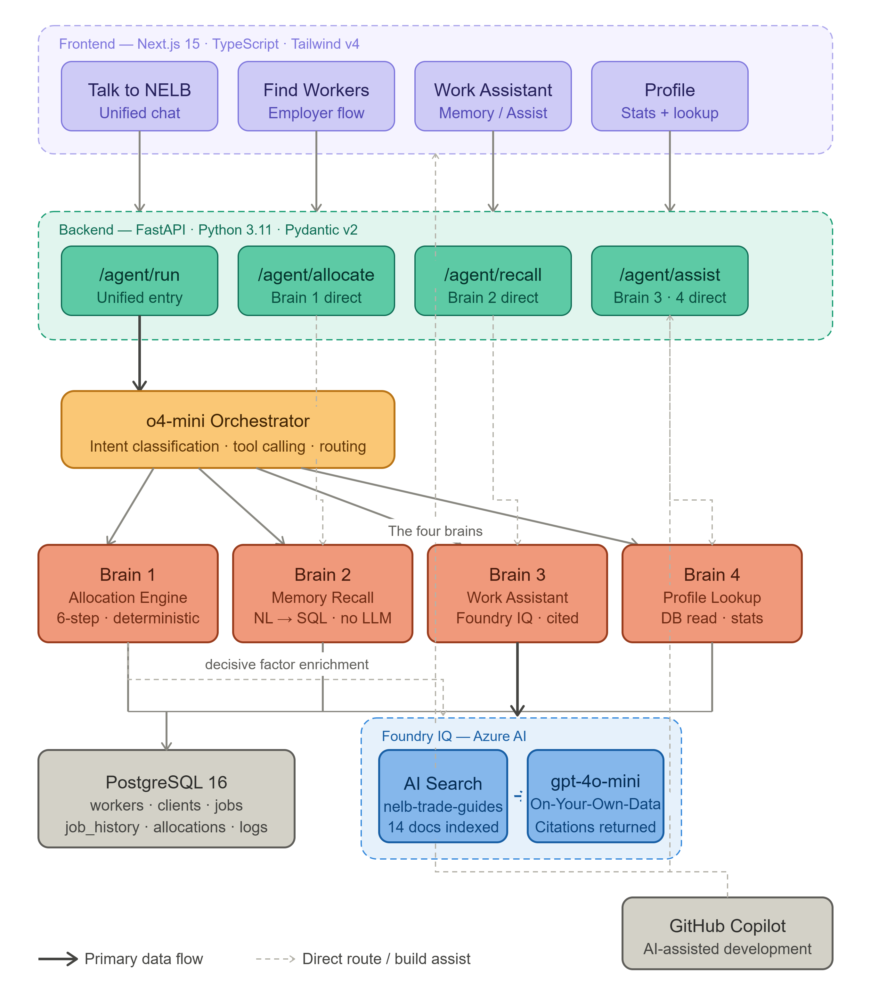

# NELB — No Employee Left Behind

> **Microsoft Agents League @ AI Skills Fest 2026 — Reasoning Agents Track**
> Azure AI Foundry · Foundry IQ · GitHub Copilot

## The Question

"What if there's a skilled plumber near you, but you don't know it yet?"

"What if you're traveling 5 km without realizing there's a better worker just 2 km away who charges less?"

"What if the system showed you exactly why it picked or recommended those specific workers?'


---

NELB is a reasoning agent for community-level work allocation. It helps people find suitable workers through transparent multi-step reasoning, helps workers recall and query their work history, and provides grounded, cited assistance for practical trade work.

---

## The problem


Matching a person who needs work done with the right worker is a reasoning problem.

The decision involves multiple factors: skills, reliability, availability, distance, budget, previous work history, and fairness. Yet in many communities — especially across the Global South — this matching is either manual and biased, or delegated to platforms that treat it as a simple search problem.

Existing platforms typically treat worker discovery as a listing or bidding problem. People must sort through applications, workers compete for attention, and the reasoning behind recommendations is invisible. The best worker may be undiscoverable because they're new, far away, or simply haven't bid yet.

At the same time, workers accumulate valuable experience through completed jobs, ratings, payments, and client relationships, but that information can be difficult to search and use effectively. They have no intelligent way to recall their own history or learn from it.

NELB treats worker allocation as a reasoning problem. Through transparent multi-step reasoning, it evaluates workers based on skills, reliability, availability, distance, budget compatibility, work history, and fairness—and shows every step of the decision.

Beyond allocation, NELB provides workers with intelligent work-history recall and contextual job assistance, transforming completed jobs into searchable knowledge and practical guidance.

NELB addresses all of this in a single agent.

---

## The core idea: one conversation, four brains

NELB looks like one chat. Underneath, it's a coordinated system that **reasons about your intent first, then routes to the right specialist** — and shows its work the whole way.

When you send a message, NELB's orchestrator (running on Azure AI Foundry) reads it, understands what you're actually trying to do, extracts the details, and hands off to one of four brains:

| You ask… | NELB routes to… | What happens |
|----------|-----------------|--------------|
| "Find me a painter, budget R1200" | **Allocation Brain** | Ranks workers through a transparent multi-step pipeline |
| "Who did I work for this year?" | **Memory Brain** | Recalls your own job history |
| "How many bags of cement for this slab?" | **Work Assistant** | Answers from a cited knowledge base (Foundry IQ) |
| "What's my reliability score?" | **Profile Brain** | Reads your profile and stats |

You never pick a tool or change pages. Three messages in the same chat can fire three different brains — the agent decides. That routing decision is itself a reasoning step, and it's what makes NELB genuinely multi-brain orchestration rather than a single LLM with tools.

**The design principle:** the language model is used for what language models are genuinely good at — understanding intent and explaining outcomes in plain words. The decision that actually matters — allocation — is deterministic, auditable, and driven by structured data and fairness constraints.

---

## Brain 1 — Allocation: reasoning you can see

When a job is posted, NELB doesn't just return the nearest available worker. It narrows the candidate pool one constraint at a time, and every elimination is visible in the reasoning trace:

| Step | What it checks |
|------|----------------|
| Self-exclusion | You can't be matched to your own job |
| Skills | Do they actually do this kind of work? (general-repair fallback is **blocked** for electrical & plumbing — safety first) |
| Reliability | Proven track record, blended with real client ratings |
| Availability | Are they open to work right now? |
| Distance | How far is the worker from the job? |
| Budget fit | Does their typical price for this work fit your budget? |
| Fairness | Have they already had plenty of work recently? |

Workers who clear every step are ranked by a weighted score across five factors — **skill, reliability, distance, fairness, and budget fit** — and the result includes a confidence signal that reflects how clear the top choice was.

Three things make this stand out:

- **Fairness is built in, not bolted on.** Workers who've already taken several recent jobs are gently penalised so others in the community get a turn. "No employee left behind" is the literal operating principle.
- **Budget is real reasoning.** Each worker's expected price is grounded in their actual earning history for that kind of job. Being cheaper never scores higher — NELB protects worker income instead of undercutting it.
- **Reputation counts.** A higher-rated worker outranks an equally reliable but lower-rated one. Newcomers aren't punished for having no ratings yet.

Every recommendation comes with a plain-language explanation of *why the top worker was chosen over the runner-up* — and that explanation is backed by a cited source from the knowledge base.

---

## Brain 2 — The Memory Brain (Work History Intelligence)

NELB transforms a worker's completed job history into a searchable memory system.

Rather than forcing workers to manually browse records, NELB allows them to ask natural-language questions about past work and receive precise answers grounded in historical job data.

Examples include:

* "Who did I install tiles for last year?"
* "What was my rating on the last plumbing job?"
* "How many gardening jobs did I complete this month?"
* "Which customer asked me to repair a gate in Pretoria East?"

NELB parses the request, identifies relevant entities such as dates, locations, job categories, ratings, and client references, then retrieves and summarizes the relevant records from the worker's job history.

The result is not merely storage of job records, but intelligent recall and retrieval of professional experience.


---

## Brain 3 — Work Assistant: grounded by Foundry IQ

A practical, on-site buddy for tools, materials, safety, and calculations:

- *"Which drill bit for a 6mm wall plug in brick?"*
- *"How many bags of cement for a 3m × 4m slab at 100mm?"*
- *"What ladder angle is safe when working at height?"*

Answers are **grounded by Foundry IQ** — retrieved from a curated knowledge base and returned with inline citations to the exact source. If the knowledge base doesn't contain the answer, NELB says so honestly rather than guessing.

This is the heart of the required Foundry IQ integration: the knowledge base is a **purpose-built corpus for community trade work**, not a generic web scrape. It even contains NELB's own allocation reasoning criteria so the system can explain *why* a decision was made.

**Knowledge base coverage (indexed in Azure AI Search):** drill bits & fasteners · cement & concrete · tiling · painting · basic electrical · basic plumbing · carpentry · ladder safety · materials estimation · tool selection · safety practices.

---

## Why this is a *reasoning* agent

NELB demonstrates multi-step reasoning at two levels:

1. **Understanding & routing** — the agent interprets natural language, classifies intent, extracts structured details, and chooses the right capability. It carries context across a conversation, so you don't have to repeat yourself.
2. **Deciding & explaining** — the allocation pipeline works through its constraints in sequence, records what happened at each step, and produces a transparent, repeatable result with grounded citations for the decisive factor.

Nothing important is a black box, and nothing important is left to chance.

---

## Job categories

NELB operates only in low-to-mid-risk civilian work — a deliberate choice for safety and trust:

`cleaning` · `gardening` · `painting` · `plumbing` · `electrical` · `tiling` · `carpentry` · `moving` · `general repair`

---

## Tech stack

| Layer | Technology |
|-------|-----------|
| Reasoning agent | **Azure AI Foundry** (o4-mini orchestrator) |
| Required IQ layer | **Foundry IQ** — grounded retrieval via Azure AI Search, with citations |
| Grounded answers | GPT-4o-mini via Azure AI Foundry |
| Backend | FastAPI · Python 3.11 · Pydantic v2 · SQLAlchemy async |
| Database | PostgreSQL 16 |
| Frontend | Next.js 15 · TypeScript · Tailwind CSS v4 · Zustand · React Leaflet |
| AI-assisted development | GitHub Copilot |
| Local environment | Docker Compose |

See `ARCHITECTURE.md` for the full system diagram.

---

---

## Running locally

**Prerequisites:** Docker Desktop · Node.js 20+ · Python 3.11+

**1. Database** (from the project root):
```bash
docker compose up -d db          # starts PostgreSQL 16
```

**2. Backend** (from `backend/`):
```bash
cd backend
python -m venv .venv
# Windows:
.venv\Scripts\activate
# macOS/Linux:
source .venv/bin/activate

pip install -e ".[dev]"          # install dependencies
python seed.py                    # create + populate demo data (safe to re-run)
python -m uvicorn app.main:app --reload --port 8000
```

**3. Frontend** (from `frontend/`, in a second terminal):
```bash
cd frontend
npm install
npm run dev
```

Open http://localhost:3000.

### Configuration & what runs without it

The database connection works out of the box against the Docker container (no `.env` required for the DB).

To enable the Azure-powered features, copy `backend/.env.example` to `backend/.env` and add your **Azure AI Foundry** and **Azure AI Search** credentials.

| Feature | Works without Azure keys? |
|---------|---------------------------|
| **Find Workers** — full 6-step allocation, reasoning trace, scoring | ✅ Yes (pure Python) |
| Memory recall (direct) | ✅ Yes |
| **Talk to NELB** — the unified agent / brain-switching | ❌ Needs Azure AI Foundry (o4-mini) |
| **Work Assistant** — Foundry IQ grounded, cited answers | ❌ Needs Azure AI Foundry + Azure AI Search |
| Allocation decisive-factor enrichment (citations) | ❌ Needs Foundry IQ |

> Without credentials, you can still run and inspect the deterministic allocation engine end-to-end. The full agent experience (brain-switching, grounded citations) is shown in the demo video and documented in `NELB-Chat-Architecture.md`.

---

## Demo guide

**Demo accounts** (from the Login button — explore NELB as a worker):

| Name | Skills |
|------|--------|
| Thabo Mabena | Painting, Tiling, General repair |
| Sarah Mokoena | Cleaning, Gardening |
| James Moyo | Carpentry, Tiling, Painting |

**Demo zone — Pretoria, South Africa.** The seeded worker community is in the Pretoria metro. If a search returns no workers, your map pin is outside the zone — use the editable coordinate field to move the pin within Pretoria.

**A 60-second tour:**
1. **Find Workers** → painting, budget **R5000** → watch the reasoning trace narrow the pool and explain the winner.
2. Repeat at budget **R500** → NELB honestly returns no match (below market). Raise it again → the shortlist returns.
3. **Talk to NELB** → send three messages and watch the brain switch:
   - `I need a cleaner for my house, budget R600` → Allocation Brain
   - `Who did I paint for this year?` (logged in as Thabo) → Memory Brain
   - `How many bags of cement for a 3m x 4m slab at 100mm?` → Work Assistant, with a citation

---

## Tested & verifiable

The allocation engine is covered by a unit-test suite (skills filtering, safety-critical blocking, reliability threshold, fairness penalty, rating blend, budget fit, distance decay, confidence).

```bash
cd backend
python -m pytest tests/test_allocation.py -v
```

---

## Design principles

1. **Fairness is structural, not aspirational** — it's enforced in the ranking, not promised in a mission statement.
2. **Explainability is mandatory** — every decision ships with a reasoning trace.
3. **Safety is enforced** — unqualified workers can't be matched to electrical or plumbing work; unsafe questions are refused.
4. **Grounded, not guessed** — the assistant cites its sources via Foundry IQ.
5. **Real history matters** — ratings and earnings feed back into allocation.
6. **Confidence must mean something** — it reflects how clear the top choice was, not just its score.
7. **No employee left behind** — the operating principle behind every part of the system.

---
## Demo Video

Watch the full NELB demonstration:

[](https://youtu.be/Soh3QfD__rA?si=0MDO0Og24DrSbodZ)

**Direct link:** https://youtu.be/Soh3QfD__rA?si=0MDO0Og24DrSbodZ

## Diagram



---.

---

*Built for the Microsoft Agents League @ AI Skills Fest 2026 — Reasoning Agents track.*
*Azure AI Foundry · Foundry IQ · GitHub Copilot*
